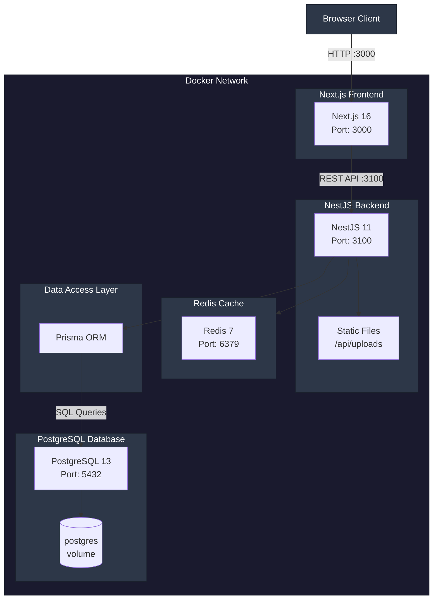

### Docker Network Architecture

```mermaid
flowchart TB
    subgraph DockerNetwork["Docker Network"]
        subgraph Frontend["Next.js Frontend"]
            NextJS["Next.js 16<br/>Port: 3000"]
        end
        
        subgraph Backend["NestJS Backend"]
            NestJS["NestJS 11<br/>Port: 3100"]
            Static["Static Files<br/>/api/uploads"]
        end

        subgraph Cache["Redis Cache"]
            Redis["Redis 7<br/>Port: 6379"]
        end
        
        subgraph Database["PostgreSQL Database"]
            Postgres["PostgreSQL 13<br/>Port: 5432"]
            Volume[("postgres<br/>volume")]
        end
        
        subgraph ORM["Data Access Layer"]
            Prisma["Prisma ORM"]
        end
    end
    
    Client["Browser Client"]
    
    Client -->|"HTTP :3000"| NextJS
    NextJS -->|"REST API :3100"| NestJS
    NestJS --> Cache
    NestJS --> Prisma
    Prisma -->|"SQL Queries"| Postgres
    Postgres --> Volume
    NestJS --> Static
    
    style DockerNetwork fill:#1a1a2e,stroke:#1a202c,color:#fff
    style Frontend fill:#2d3748,stroke:#1a202c,color:#fff
    style Backend fill:#2d3748,stroke:#1a202c,color:#fff
    style Cache fill:#2d3748,stroke:#1a202c,color:#fff
    style Database fill:#2d3748,stroke:#1a202c,color:#fff
    style ORM fill:#2d3748,stroke:#1a202c,color:#fff
    style Client fill:#2d3748,stroke:#1a202c,color:#fff
```